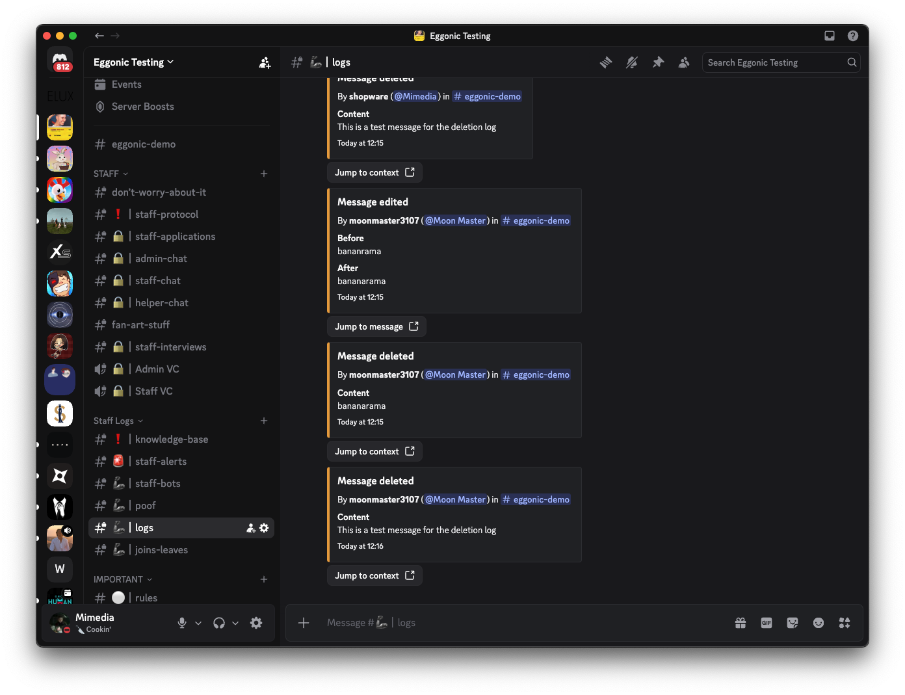
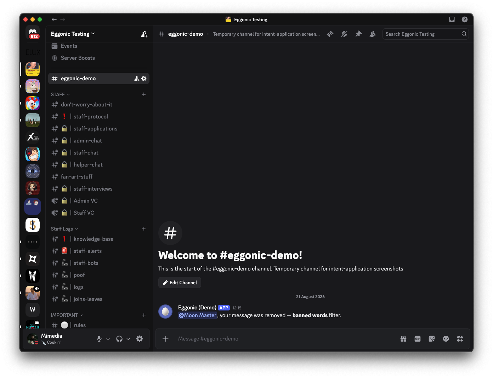

# Eggonic — Message Content Intent: Feature Evidence

Two screenshots from a live server. All features shown require reading
message text and are configured per server, off by default.

**1. Message logging with content.** Deleted messages logged with their
text and a jump-to-context button, and an edit logged with its
before/after diff and a jump-to-message button. The sequence also shows
filter evasion handling: a member edited a clean message INTO a banned
word, and the filter caught the edit and removed it:

**2. Chat filter enforcement.** The automatic in-channel removal notice
answering the member whose message the filter deleted:

