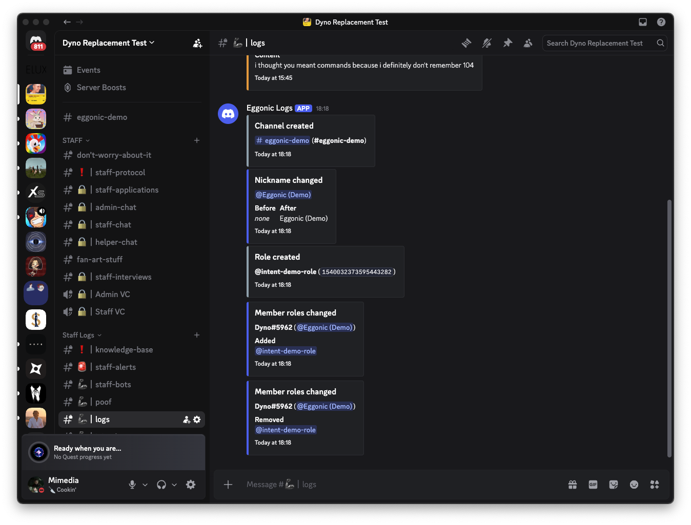

# Eggonic — Server Members Intent: Feature Evidence

The screenshot below shows Eggonic's logging output in a live server. Every
entry shown is produced by a member gateway event that only the Server
Members intent delivers:

- **Nickname changed** (with before/after) — from GUILD_MEMBER_UPDATE; the
  same event stream powers automatic nickname dehoisting.
- **Member roles changed** (added / removed) — from GUILD_MEMBER_UPDATE;
  the same stream powers role persistence across rejoins.
- **Channel created** appears because the temporary demo channel was created
  for this capture; join/leave logging, welcome messages, automatic roles
  and join-rate anti-raid protection ride GUILD_MEMBER_ADD / REMOVE from the
  same intent.

